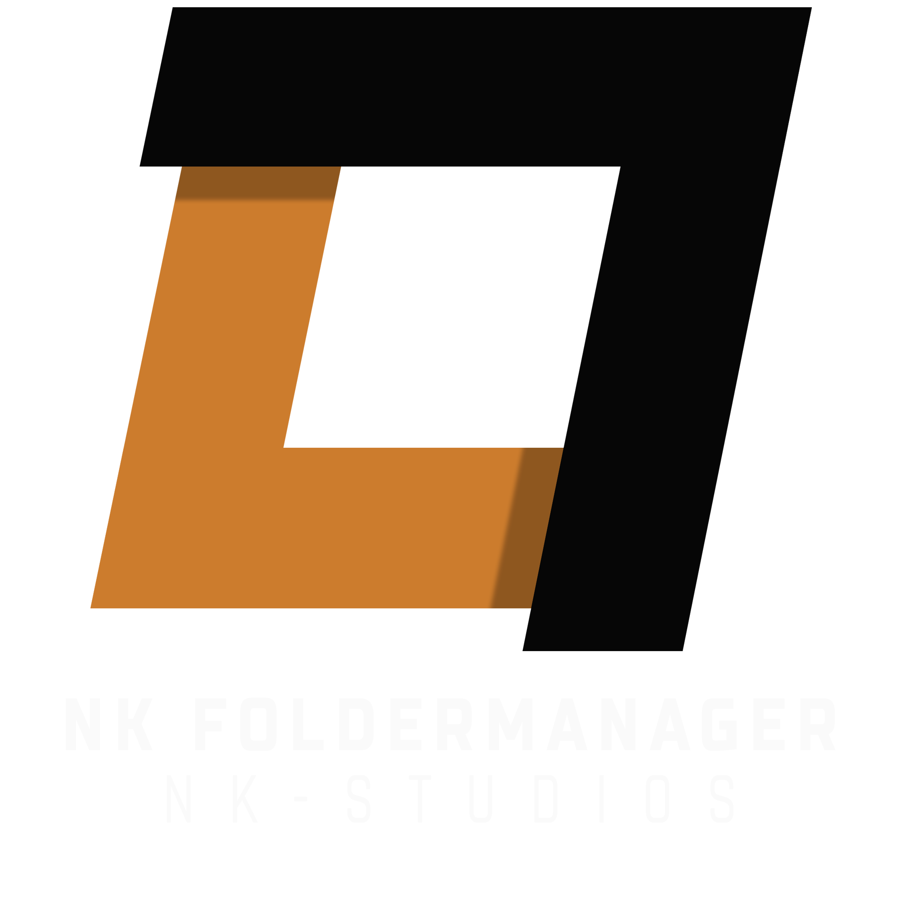

<!-- HEADER -->

  

<!-- MAIN INFORMATION -->

  <a href="#-nkfoldermanager---password-protected-folders">Overview</a> •
  <a href="/CHANGELOG.md">Changelog</a> •
  <a href="https://nicekype.de">Website</a> •
  <a href="https://github.com/NiceKype/nkFolderManager?tab=License-1-ov-file">License</a> 
  
  
  
  
  
  
  

 

<!-- DESCRIPTION -->
#  nkFolderManager - Password protected folders
The name already suggests what the tool can do. But it can do much more than just password-protect folders.
I was tired of constantly protecting folders with .htaccess and .htpasswd. Most web server users are familiar with this. This pop-up window where you enter your login credentials looks incredibly ugly and uninspired.
I programmed a web app with FolderManager that makes the whole thing more attractive and technically sophisticated.
With a full-fledged user system, a user interface, and an ACP for managing accounts and access, the simple pop-up window becomes a more enjoyable experience!

 

<!-- FEATURES -->
## 》FEATURES
- Folders are protected by user access
- Login with username and password
- User Interface (with overview of shared folders)
- ACP (dashboard with statistics)
- User Management [ACP] (Here you can create/edit/toggle/delete users and team members and share folders)
- Action Logging - Log Viewer [ACP] (Various actions are logged and visible in the Log Viewer)
- MySQL storage (All data such as accounts and logs are stored in a database, passwords are of course encrypted)
- Config (All settings can be found in Config.php)

 

<!-- PREVIEW -->
## 》PREVIEW
> [!IMPORTANT]
> The preview images will follow as soon as the tool is released!

 

<!-- PLANNED FEATURES -->
## 》PLANNED FEATURES
- [ ] User profiles (User has a profile with avatar and password reset option (currently only admins can reset the password))
- [ ] Email Integration (Email als login method and option to change it)
- [ ] Configurable groups (Option to create and edit own groups (currently the groups admin, staff and customer is pre-defined))
- [ ] Rights management (Configure the rights of the groups)
- [ ] Contact form (A simple contact form)
- [ ] Installer (A short installer script for automatic installation)
- [ ] Settings Page (For setting colors, logos and more)

 

<!-- SUPPORT -->
## 》SUPPORT

 

> [!TIP]
> You want a translation of the tool in your language and it's currently not available, then you can help us by request your language and submit a translation [HERE](https://crowdin.com/project/nkfoldermanager).

**Status of the translation:** 

 

<!-- LICENSE -->
## 》LICENSE
🛡️ This tool is licensed under: [NKS-Public-License (NPS-1.1)](/LICENSE) – see terms before using or modifying this code.
